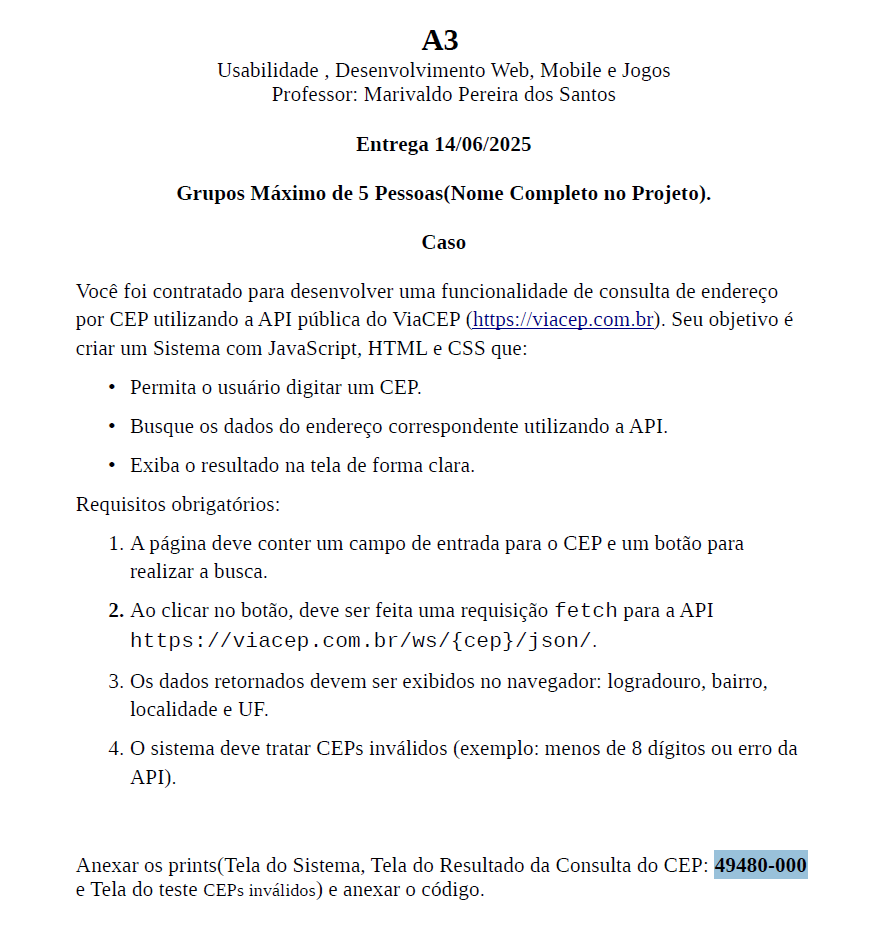
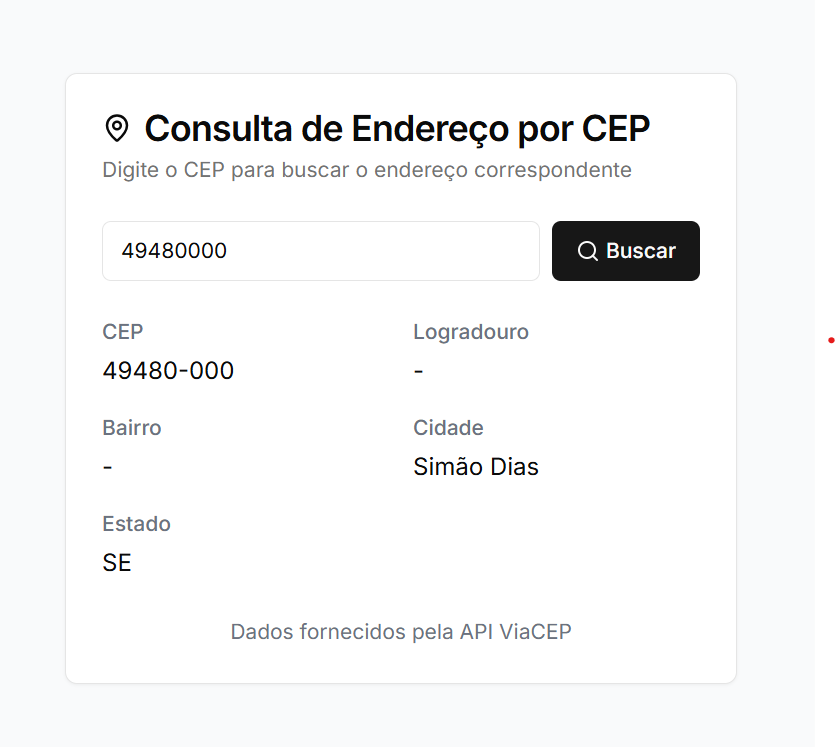

## Detalhes:

O projeto foi desenvolvido usando NextJs. Consiste de uma tela com um input para buscar o CEP desejado e retorna uma resposta da API ViaCEP com os dados de forma estruturada. Tem validações para garantir que o número colocado no input seja um CEP válido

## Proposta do trabalho:
 

## Print das telas
  |   |    |   

### Como rodar:

Clone o projeto para sua máquina, execute npm install para instalar os pacotes e depois 'npm run dev' para rodar localmente
